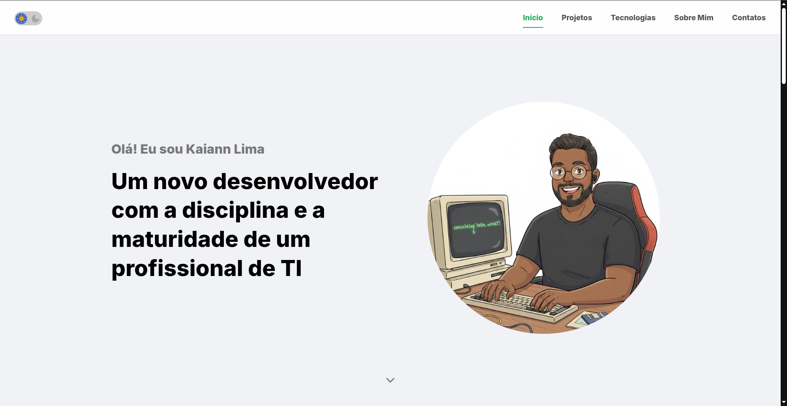

# Portfólio Pessoal com HTML, CSS e JavaScript

Este projeto é um portfólio pessoal desenvolvido como um desafio de front-end. O objetivo é construir uma interface responsiva e moderna **sem o uso de frameworks CSS (como Bootstrap ou Tailwind)**, aplicando apenas **CSS puro** e **HTML semântico**, além das funcionalidades com **JavaScript**.

## 🎨 Visualização

---

## 🎯 Principais Desafios e Recursos

* **CSS Puro:** Todo o layout e estilização foram feitos "do zero", sem bibliotecas ou frameworks.
* **Design Responsivo:** O site está sendo desenvolvido para se adaptar a diversos tamanhos de telas (desktop, tablet e mobile).
* **HTML Semântico:** Uso correto das tags HTML5 para melhor acessibilidade e SEO.

---

## 🛠️ Tecnologias Utilizadas

* **HTML5**
* **CSS3**
* **JavaScript** (para interatividade, menu mobile, etc.)

---

## 🚀 Como Acessar

Você pode visualizar o projeto em funcionamento [clicando aqui](https://kaiannlima.github.io/Portfolio/).

Para executar localmente, basta clonar o repositório e abrir o arquivo `index.html` no seu navegador.